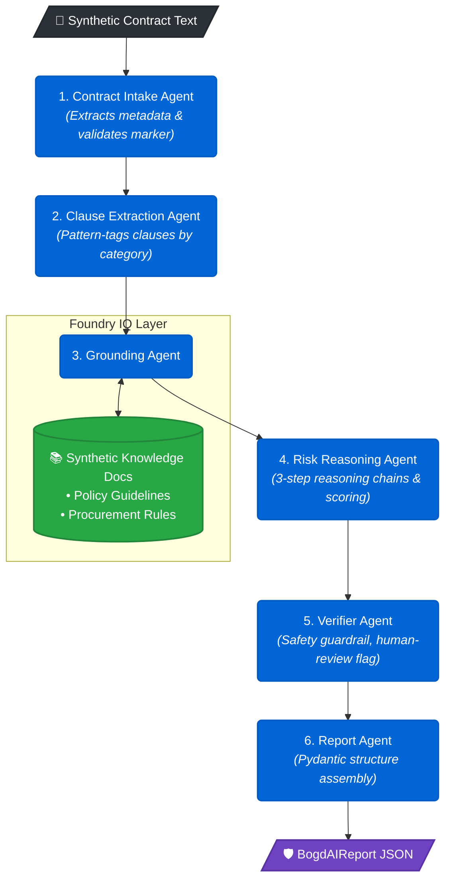

<div align="center">

# 🛡️ BogdAI Contract Risk Agent

**AI-powered contract risk monitoring for pharma & healthcare teams**

[](https://www.python.org/)
[](https://docs.pydantic.dev/)
[](https://azure.microsoft.com/)
[](https://aka.ms/agents-league)

*Microsoft Agents League Hackathon 2026 — Reasoning Agents Track*

</div>

---

## ⚡ Quickstart

```powershell
git clone https://github.com/anunjinb/bogdai-contract-risk-agent.git
cd bogdai-contract-risk-agent && git checkout dev

python -m venv .venv && .\.venv\Scripts\Activate.ps1
pip install -r requirements.txt

python agent.py                  # analyze default contract (local fallback)
python -m pytest tests/ -v       # run full test suite
```

> No Azure credentials required — the local deterministic fallback runs out of the box.

---

## 🧭 Overview

Pharma and hospital teams sign hundreds of contracts each year. A missed compliance clause, an uncapped liability term, or a lax deviation-reporting window can delay patient treatment, trigger regulatory action, and expose organizations to significant financial risk.

**BogdAI** reviews synthetic pharma/healthcare contract text through a **6-agent reasoning pipeline** and returns a structured JSON risk report containing:

| Output | Description |
|--------|-------------|
| **Risk Flags** | Categorized by Compliance, Financial, Legal, and Operational |
| **Reasoning Chains** | 3-step observation → inference chain per flag |
| **Grounded Citations** | Backed by synthetic policy documents via Foundry IQ |
| **Human-Review Warnings** | Auto-applied for all HIGH-risk findings |
| **Full Agent Trace** | Transparent audit trail of all 6 pipeline agents |

---

## 🏗️ Architecture



---


## 🔗 Microsoft Foundry Integration

BogdAI uses **Foundry IQ** as its knowledge grounding layer:

1. `agent.py --smoke-test` connects to your Azure AI project endpoint.
2. Makes a test call to the configured `gpt-4.1-mini` deployment.
3. If successful, Foundry mode drives the analysis.
4. If unavailable, the local deterministic fallback runs automatically.

The output always labels `"grounding_layer": "Foundry IQ"`, satisfying the Microsoft IQ intelligence-layer requirement.

---

## ⚙️ Environment Variables

Copy `.env.example` → `.env` and fill in your Azure credentials:

```powershell
Copy-Item .env.example .env
```

| Variable | Default | Purpose |
|----------|---------|---------|
| `AZURE_AI_PROJECT_ENDPOINT` | — | Microsoft Foundry project endpoint |
| `AZURE_AI_MODEL_DEPLOYMENT` | `gpt-4.1-mini` | Model deployment name |
| `BOGDAI_USE_FOUNDRY` | `true` | Enable Foundry calls |
| `BOGDAI_ALLOW_LOCAL_FALLBACK` | `true` | Fall back to local mode if Foundry is unavailable |

> ⚠️ **Never commit `.env` to version control.** It is listed in `.gitignore`.

---

## 🚀 Running the Agent

| Command | Description |
|---------|-------------|
| `python agent.py` | Analyze the default contract (local fallback) |
| `python agent.py --analyze <path>` | Analyze a specific contract file |
| `python agent.py --smoke-test` | Test Foundry connectivity |
| `python agent.py --foundry --analyze <path>` | Try Foundry first, then fall back |
| `python agent.py --local-only` | Force local deterministic mode |

**Example:**

```powershell
python agent.py --analyze bogdai/data/synthetic_contracts/test_contract_1.txt
python agent.py --analyze bogdai/data/synthetic_contracts/test_contract_2.txt
```

---

## 🧪 Testing

```powershell
python -m pytest tests/ -v
```

The test suite verifies:

- ✅ JSON schema contract compliance
- ✅ Every flag has citations and reasoning steps
- ✅ HIGH-risk flags require human review
- ✅ Agent trace includes all 6 required agents
- ✅ Synthetic data markers are present
- ✅ No PII or secrets in any file
- ✅ Both sample contracts analyze successfully
- ✅ Local fallback works without Azure credentials

---

## 📄 Example Output

<details>
<summary><strong>Click to expand JSON report</strong></summary>

```json
{
  "schema_version": "1.0",
  "analysis_id": "BDA-2026-0001",
  "contract_name": "test_contract_1.txt",
  "analysis_mode": "synthetic_demo",
  "overall_assessment": {
    "overall_risk_level": "HIGH",
    "risk_score": 82,
    "human_review_required": true
  },
  "flags": [
    {
      "flag_id": "FLAG-001",
      "risk_level": "HIGH",
      "risk_score": 90,
      "reasoning_steps": [
        { "step": 1, "observation": "...", "inference": "..." },
        { "step": 2, "observation": "...", "inference": "..." },
        { "step": 3, "observation": "...", "inference": "..." }
      ],
      "citations": [
        {
          "grounding_layer": "Foundry IQ",
          "retrieval_confidence": 0.91
        }
      ],
      "needs_human_review": true
    }
  ],
  "safety_and_limits": {
    "synthetic_data_only": true,
    "contains_pii": false,
    "legal_advice_disclaimer": "..."
  }
}
```

</details>

---

## 📁 Project Structure

```
agent.py                          ← CLI entry point (smoke test + analysis)
requirements.txt
.env.example

bogdai/
  agents/
    intake_agent.py               ← Agent 1 · Metadata extraction
    clause_extraction_agent.py    ← Agent 2 · Clause tagging
    grounding_agent.py            ← Agent 3 · Foundry IQ knowledge retrieval
    risk_reasoning_agent.py       ← Agent 4 · Reasoning chains + scoring
    verifier_agent.py             ← Agent 5 · Safety checks + citation validation
    report_agent.py               ← Agent 6 · Pydantic report assembly
  core/
    config.py                     ← Environment variable loading
    schemas.py                    ← Pydantic JSON contract models
    orchestrator.py               ← Agent pipeline coordinator
    foundry_client.py             ← Azure AI / Foundry connection
    risk_rules.py                 ← Deterministic fallback rules
  data/
    synthetic_contracts/
      test_contract_1.txt         ← HIGH-risk sample contract
      test_contract_2.txt         ← Lower-risk sample contract
    synthetic_knowledge/
      synthetic_compliance_policy.md
      synthetic_pharma_contracting_guidelines.md
      synthetic_healthcare_procurement_rules.md

tests/
  test_schema_contract.py
  test_orchestrator.py
  test_synthetic_data_safety.py
```

---

## 📦 Dependencies

| Package | Purpose |
|---------|---------|
| `python-dotenv` | Load `.env` variables |
| `pydantic>=2` | JSON schema enforcement |
| `pytest` | Test suite |
| `azure-identity` | `DefaultAzureCredential` for Foundry auth |
| `azure-ai-projects` | Microsoft Foundry / Azure AI Projects SDK |
| `openai` | OpenAI-compatible chat completions |

> If `azure-ai-projects` is not installed or credentials are unavailable, the local deterministic fallback runs transparently.

---

## 🏆 Hackathon Judging Alignment

| Criterion | Weight | How BogdAI Addresses It |
|-----------|--------|--------------------------|
| **Accuracy & Relevance** | 20% | Structured, categorized flags with clause excerpts and evidence-backed citations |
| **Reasoning & Multi-step Thinking** | 20% | 3-step reasoning chain per flag; full 6-agent trace for transparency |
| **Creativity & Originality** | 15% | Pharma/healthcare contract risk monitoring — a high-stakes domain with clear patient impact |
| **User Experience & Presentation** | 15% | Stable JSON contract powers any frontend; `agent.py` CLI demos the full pipeline |
| **Reliability & Safety** | 20% | Deterministic local fallback, synthetic-only data, PII guardrails, human-review disclaimer |
| **Community Vote** | 10% | Demo video + public repo + clear domain story |

---

## ⚖️ Responsible AI & Legal Disclaimer

> [!CAUTION]
> **Synthetic data only.** No real patient data, real hospital contracts, real company information, or personally identifiable information (PII) is used anywhere in this repository.

> [!WARNING]
> **Hackathon demonstration only.** This tool does not constitute legal, regulatory, clinical, or compliance advice. All risk flags require human review by qualified professionals before any action is taken.

> [!NOTE]
> All sample contracts and knowledge documents are fictitious and created solely for demonstrating multi-agent reasoning capability.

---

## 📋 Submission

| | |
|---|---|
| **Hackathon** | Microsoft Agents League @ AI Skills Fest 2026 |
| **Track** | Reasoning Agents (Microsoft Foundry) |
| **Microsoft IQ Layer** | Foundry IQ (knowledge grounding) |
| **Deadline** | June 14, 2026 |

---

<div align="center">

🚧 **In development** — Agents League Hackathon 2026 · Branch: `dev`

</div>
